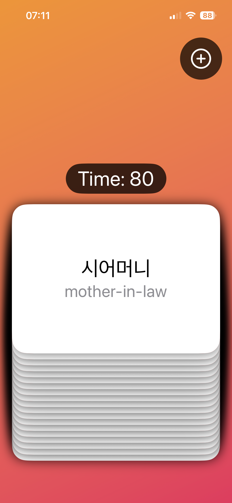
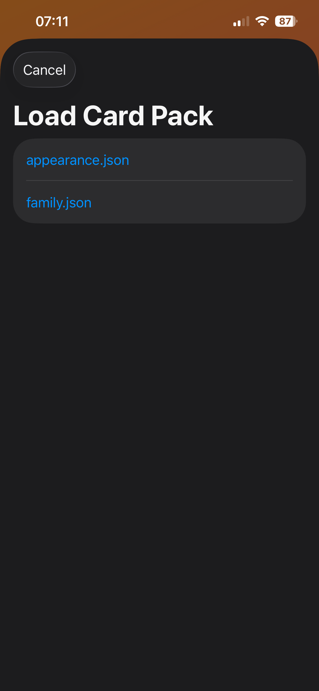

# K-flashcards

Simple flashcards app based on "Hacking with SwiftUI" course by Paul Hudson.  
Downloads Korean card packs from a remote server (currently: my website).

## Screenshots

Cards do not show the answer until they are tapped.  

Once a card is tapped, it toggles the isShowingAnswer boolean.  

Swipe right if you know the word.  

Swipe left if you don't know the word.  

Load card packs from my server.  

